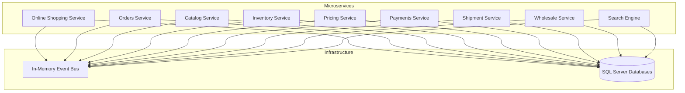

# Design Document

## Overview

The dist-shop system is a distributed e-commerce platform built using .NET 8 microservices architecture following Domain-Driven Design (DDD) principles. The system consists of eight bounded contexts, each implemented as an independent microservice with its own database and domain model. The architecture emphasizes loose coupling through event-driven communication while maintaining data consistency through eventual consistency patterns.

## Architecture

### High-Level Architecture



### Technology Stack

- **Framework**: .NET 9 with ASP.NET Core
- **Database**: SQL Server with Entity Framework Core
- **Message Broker**: Simple in-memory event bus (demonstrating structure)
- **Documentation**: Swagger/OpenAPI

## Components and Interfaces

### 1. Online Shopping Service

**Responsibilities:**
- Cart management (add, remove, update items)
- Checkout orchestration
- Customer session management
- Integration with pricing and inventory services

**Key Components:**
- `CartAggregate`: Domain aggregate managing cart state
- `CheckoutSaga`: Orchestrates checkout process
- `CartController`: REST API endpoints
- `CartRepository`: Data persistence
- `PricingIntegrationService`: Integration with Pricing Service

### 2. Orders Service

**Responsibilities:**
- Order lifecycle management
- Order state transitions
- Order validation and processing
- Integration with inventory and shipment services

**Key Components:**
- `OrderAggregate`: Core domain aggregate
- `OrderStateMachine`: Manages order state transitions
- `OrderRepository`: Data access layer
- `OrderEventHandlers`: Processes domain events

### 3. Catalog Service

**Responsibilities:**
- Product information management
- Category hierarchy
- Product specifications and attributes
- Product data synchronization

**Key Components:**
- `ProductAggregate`: Product domain model
- `CategoryAggregate`: Category hierarchy management
- `ProductRepository`: Data persistence
- `CatalogSyncService`: Data synchronization

### 4. Inventory Service

**Responsibilities:**
- Stock level management
- Stock reservations
- Inventory adjustments
- Low stock alerts

**Key Components:**
- `InventoryAggregate`: Stock management domain model
- `StockReservationService`: Handles stock reservations
- `InventoryRepository`: Data access
- `StockLevelMonitor`: Monitors stock levels

### 5. Pricing Service

**Responsibilities:**
- Price calculations based on rules
- Pricing strategy management
- Promotional pricing
- Wholesale pricing tiers

**Key Components:**
- `PricingEngine`: Core pricing calculation logic
- `PricingRuleAggregate`: Pricing rules management
- `PriceCalculatorService`: Price calculation service
- `PricingRepository`: Pricing data persistence

### 6. Payments Service

**Responsibilities:**
- Payment processing orchestration
- Payment provider integration (stub implementations)
- Payment transaction management
- Payment status tracking

**Key Components:**
- `PaymentAggregate`: Payment domain model
- `PaymentProviderFactory`: Provider abstraction
- `PaymentProcessor`: Payment processing logic
- `PaymentRepository`: Transaction storage

### 7. Shipment Service

**Responsibilities:**
- Shipment creation and tracking
- Delivery status updates
- Shipping provider integration
- Delivery notifications

**Key Components:**
- `ShipmentAggregate`: Shipment domain model
- `TrackingService`: Shipment tracking logic
- `ShippingProviderService`: External provider integration
- `ShipmentRepository`: Shipment data storage

### 8. Wholesale Service

**Responsibilities:**
- Bulk order processing (no cart functionality)
- Wholesale customer validation
- Minimum order quantity enforcement
- Direct order creation

**Key Components:**
- `WholesaleOrderAggregate`: Bulk order domain model
- `WholesaleCustomerService`: Customer validation
- `BulkOrderProcessor`: Direct order processing
- `WholesaleRepository`: Data persistence

### 9. Search Engine

**Responsibilities:**
- Product search and filtering
- Search index management
- Search result ranking
- Search analytics

**Key Components:**
- `SearchService`: Core search functionality
- `IndexManager`: Search index management
- `SearchRepository`: Search data storage
- `ProductIndexer`: Product data indexing

## Data Models

### Core Domain Entities

#### Online Shopping Service
```csharp
public class Cart : AggregateRoot
{
    public Guid Id { get; private set; }
    public Guid CustomerId { get; private set; }
    public List<CartItem> Items { get; private set; }
    public DateTime CreatedAt { get; private set; }
    public DateTime UpdatedAt { get; private set; }
}

public class CartItem : Entity
{
    public Guid ProductId { get; private set; }
    public int Quantity { get; private set; }
    public decimal UnitPrice { get; private set; }
}
```

#### Orders Service
```csharp
public class Order : AggregateRoot
{
    public Guid Id { get; private set; }
    public Guid CustomerId { get; private set; }
    public OrderStatus Status { get; private set; }
    public List<OrderItem> Items { get; private set; }
    public decimal TotalAmount { get; private set; }
    public DateTime CreatedAt { get; private set; }
}

public enum OrderStatus
{
    Pending, Confirmed, Processing, Shipped, Delivered, Cancelled
}
```

#### Inventory Service
```csharp
public class InventoryItem : AggregateRoot
{
    public Guid ProductId { get; private set; }
    public int AvailableQuantity { get; private set; }
    public int ReservedQuantity { get; private set; }
    public int ReorderLevel { get; private set; }
}
```

#### Pricing Service
```csharp
public class PricingRule : AggregateRoot
{
    public Guid Id { get; private set; }
    public string Name { get; private set; }
    public PricingStrategy Strategy { get; private set; }
    public decimal Value { get; private set; }
    public DateTime ValidFrom { get; private set; }
    public DateTime ValidTo { get; private set; }
}
```

### Event Models

Each service owns and defines its own events to maintain service independence and avoid shared kernel anti-patterns. Services define events in separate contract modules within their boundaries:

**Service-Owned Event Definitions:**

**Online Shopping Service Events:**
```csharp
// NoesisVision.DistShop.OnlineShopping.Contracts
public record ProductAddedToCart(Guid CartId, Guid ProductId, int Quantity);
public record CartCheckoutRequested(Guid CartId, Guid CustomerId, List<CartItemDto> Items);
```

**Orders Service Events:**
```csharp
// NoesisVision.DistShop.Orders.Contracts  
public record OrderCreated(Guid OrderId, Guid CustomerId, decimal TotalAmount);
public record OrderStatusChanged(Guid OrderId, string NewStatus);
```

**Inventory Service Events:**
```csharp
// NoesisVision.DistShop.Inventory.Contracts
public record StockReserved(Guid ProductId, int Quantity, Guid ReservationId);
public record InventoryUpdated(Guid ProductId, int NewQuantity);
```

**Event and Command Conventions:**

**Naming Conventions:**
- **Events**: Use past tense with "Event" suffix (e.g., `ProductAddedToCartEvent`, `OrderCreatedEvent`)
- **Commands**: Use imperative with "Command" suffix (e.g., `AddProductToCartCommand`, `CreateOrderCommand`)
- **Queries**: Use descriptive with "Query" suffix (e.g., `GetCartQuery`, `SearchProductsQuery`)

**Interface Contracts:**
```csharp
// Base interfaces in shared foundation
public interface IEvent
{
    Guid EventId { get; }
    DateTime OccurredAt { get; }
    string EventType { get; }
}

public interface ICommand
{
    Guid CommandId { get; }
    DateTime IssuedAt { get; }
}

public interface IQuery<TResult>
{
    Guid QueryId { get; }
}
```

**Implementation Examples:**
```csharp
// Events (past tense, what happened)
public record ProductAddedToCartEvent(
    Guid CartId, 
    Guid ProductId, 
    int Quantity) : IEvent
{
    public Guid EventId { get; } = Guid.NewGuid();
    public DateTime OccurredAt { get; } = DateTime.UtcNow;
    public string EventType { get; } = nameof(ProductAddedToCartEvent);
}

// Commands (imperative, what to do)
public record AddProductToCartCommand(
    Guid CartId, 
    Guid ProductId, 
    int Quantity) : ICommand
{
    public Guid CommandId { get; } = Guid.NewGuid();
    public DateTime IssuedAt { get; } = DateTime.UtcNow;
}

// Queries (what to retrieve)
public record GetCartQuery(Guid CartId) : IQuery<CartDto>
{
    public Guid QueryId { get; } = Guid.NewGuid();
}
```

**Event Organization Principles:**
- Each service defines its own events in a separate contracts module/namespace
- Services can evolve their event schemas independently
- Consuming services depend only on the specific event contracts they need
- Event versioning is handled per service, maintaining deployment independence
- No shared event definitions across service boundaries


## Error Handling

### Exception Hierarchy
```csharp
public abstract class DomainException : Exception
{
    protected DomainException(string message) : base(message) { }
}

public class InsufficientStockException : DomainException
{
    public InsufficientStockException(Guid productId, int requested, int available)
        : base($"Insufficient stock for product {productId}. Requested: {requested}, Available: {available}") { }
}

public class InvalidCartOperationException : DomainException
{
    public InvalidCartOperationException(string operation)
        : base($"Invalid cart operation: {operation}") { }
}
```

### Error Response Models
```csharp
public class ErrorResponse
{
    public string Code { get; set; }
    public string Message { get; set; }
    public Dictionary<string, string[]> Errors { get; set; }
    public DateTime Timestamp { get; set; }
}
```


## Infrastructure Patterns

### Repository Pattern
```csharp
// AggregateRoot base class from NoesisVision.DistShop.SharedKernel
public abstract class AggregateRoot : Entity
{
    private readonly List<IEvent> _domainEvents = new();
    
    public IReadOnlyCollection<IEvent> DomainEvents => _domainEvents.AsReadOnly();
    
    protected void AddDomainEvent(IEvent domainEvent)
    {
        _domainEvents.Add(domainEvent);
    }
    
    public void ClearDomainEvents()
    {
        _domainEvents.Clear();
    }
}

public abstract class Entity
{
    public Guid Id { get; protected set; }
    
    protected Entity()
    {
        Id = Guid.NewGuid();
    }
}

// Repository interface using our AggregateRoot
public interface IRepository<T> where T : AggregateRoot
{
    Task<T> GetByIdAsync(Guid id);
    Task<IEnumerable<T>> GetAllAsync();
    Task AddAsync(T entity);
    Task UpdateAsync(T entity);
    Task DeleteAsync(Guid id);
}
```

### Unit of Work Pattern
```csharp
public interface IUnitOfWork
{
    Task<int> SaveChangesAsync(CancellationToken cancellationToken = default);
    Task BeginTransactionAsync();
    Task CommitTransactionAsync();
    Task RollbackTransactionAsync();
}
```

### Event Sourcing (Optional for Order Service)
```csharp
public interface IEventStore
{
    Task SaveEventsAsync(Guid aggregateId, IEnumerable<DomainEvent> events, int expectedVersion);
    Task<IEnumerable<DomainEvent>> GetEventsAsync(Guid aggregateId);
}
```

## Shared Kernel Contents

The shared kernel (`NoesisVision.DistShop.SharedKernel`) will contain only the absolute minimum foundational elements:

**Domain Building Blocks:**
- `AggregateRoot` - Base class for domain aggregates with domain event support
- `Entity` - Base class for domain entities with identity
- `ValueObject` - Base class for value objects with equality semantics
- `DomainException` - Base exception class for domain-specific exceptions

**Infrastructure Abstractions:**
- `IRepository<T>` - Generic repository interface
- `IUnitOfWork` - Unit of work pattern interface
- `IEventBus` - Event publishing abstraction

**CQRS Contracts:**
- `IEvent` - Base interface for all events
- `ICommand` - Base interface for all commands  
- `IQuery<TResult>` - Base interface for all queries

**What's NOT in Shared Kernel:**
- No business logic or domain-specific rules
- No concrete implementations (only abstractions)
- No event definitions (each service owns its events)
- No DTOs or data models
- No service-specific interfaces

## Implementation Notes

This is a demonstration repository showcasing the structure of a distributed e-commerce system. The focus is on:

- Clean architecture and domain-driven design patterns
- Proper separation of concerns between bounded contexts
- Event-driven communication patterns (with simple in-memory implementation)
- .NET best practices and conventions
- Repository and service patterns
- Domain entities, commands, queries, and events structure

The implementation prioritizes code structure and patterns over production-ready features like authentication, caching, or complex message brokers.